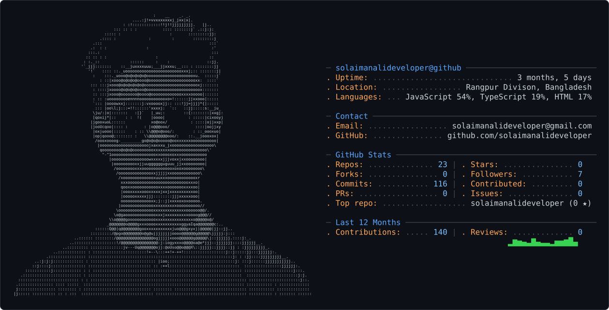

 

  

---

<picture>
  <source media="(prefers-color-scheme: dark)" srcset="dark_mode.svg" />
  <source media="(prefers-color-scheme: light)" srcset="light_mode.svg" />
  
</picture>

---

## `03 // ABOUT ME`

I'm **Solaiman Ali**, a Full-Stack Developer focused on building practical, responsive, and production-oriented web applications.

I work across the full development cycle — from crafting modern interfaces with React, Next.js, TypeScript, and Tailwind CSS to building backend systems and APIs with Node.js, Express.js, and database technologies such as MongoDB.

I'm continuously expanding into AI Engineering, exploring LLMs, RAG, AI Agents, embeddings, and intelligent application workflows while strengthening my foundations in webapp architecture, testing.

My goal is to build software that isn't just functional, but scalable, maintainable, intelligent, and genuinely useful — growing toward becoming an AI-Powered Full-Stack Web Developer.

---

## `04 // TECH ARSENAL`

### Frontend

  

### Backend

  

### Database

  

### DevOps & Cloud

  

### Tools

  

---

## `06 // CURRENTLY`

| Area        | Focus                                               |
| ----------- | --------------------------------------------------- |
| `BUILDING`  | Full-stack web applications & SaaS products         |
| `LEARNING`  | TypeScript • Next.js  • System Design               |
| `EXPLORING` | AI Engineering • LLMs • AI Agents                   |
| `DEPLOYING` | Vercel • GitHub Actions                             |
| `IMPROVING` | Web Application Architecture • Testing • Security   |
| `GOAL`      | Becoming an AI-Powered Full-Stack Web Engineer |

---

## `07 // LeetCode Statistics`

---

## `08 // Contribution Streak`

  

---

## `09 // Contribution Graph`

  

---

## `10 // GitHub Profile`

  

  
  

---

## `11 // CONNECT`

    

   

 

<code>OPEN TO BUILD • COLLABORATE • CREATE</code>

---

### `BUILD • BREAK • LEARN • REBUILD`

